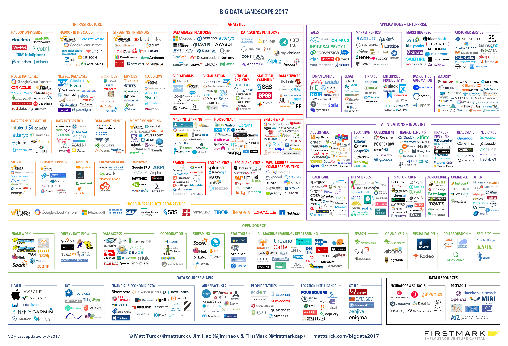

### 关于BI（商业智能）

[商业智能-百度百科](https://baike.baidu.com/item/%E5%95%86%E4%B8%9A%E6%99%BA%E8%83%BD/406141?fr=aladdin)
[OLAP与大数据](https://yq.aliyun.com/articles/664733)
[MSDN-大数据架构](https://docs.microsoft.com/zh-cn/azure/architecture/data-guide/big-data/)

**BI分类**

驱动方式|预生成Cube|交付时间|自服务|抗需求变化能力|代表
-|-
【传统】数据驱动|需要|(半)年|不能|差(月)|BIEE、MSBI、SmartBI
【新兴】业务驱动|不需要|周/月|能|强(周/天)|[FineBI](http://www.finebi.com/)、[Yonghong Z-Suite](http://www.yonghongtech.com/cp/suite/)、[Style Intelligence](https://www.inetsoft.com/products/StyleIntelligence/)、[tableau](https://www.tableau.com/)、[QlikView](https://www.qlik.com/us/products/qlikview)

**OLAP分类**

名称|描述|细节数据存储位置|聚合后数据存储位置|举例
-|-
ROLAP(Relational OLAP)|基于关系数据库的OLAP实现|关系型数据库|关系型数据库|MSBI
MOLAP(Multidimensional OLAP)|基于多维数据组织的OLAP实现|数据立方体|数据立方体|Kylin
HOLAP(Hybrid OLAP)|基于混合数据组织的OLAP实现|关系型数据库|数据立方体|？

ROLAP通过工具或者中间件将多维数据存储在关系数据库上，也被称为虚拟OLAP（VirtualOLAP）。
MOLAP采用专用存储结构，也被称为物理OLAP（PhysicalOLAP）。

ROLAP灵活旦响应慢，MOLAP响应快但会有“数据爆炸”问题

** BI知名解决方案 **

[Oracle BIEE](https://www.oracle.com/technetwork/middleware/bi-enterprise-edition/overview/index.html)  
[SAP BO](https://www.sap.com/products/bi-platform.html)   
[IBM Cognos](https://www.ibm.com/products/cognos-analytics)    
[MSBI](https://www.microsoft.com/zh-cn/sql-server/business-intelligence)   
[微策略](https://www.microstrategy.cn/cn/)  

**SQL Server Analysis Services (SSAS)**

[SSDT(AS+RS+IS)](https://docs.microsoft.com/ZH-CN/sql/ssdt/download-sql-server-data-tools-ssdt?view=sql-server-2017)   
[SSAS教程](https://docs.microsoft.com/zh-cn/sql/analysis-services/data-mining-tutorials-analysis-services?view=sql-server-2017)  
[多维表达式 (MDX) 参考](https://docs.microsoft.com/zh-cn/sql/mdx/multidimensional-expressions-mdx-reference?view=sql-server-2017)  
[数据分析表达式 (DAX) 参考](https://technet.microsoft.com/zh-cn/library/gg413422.aspx)  
[数据挖掘算法](https://docs.microsoft.com/zh-cn/sql/analysis-services/data-mining/data-mining-algorithms-analysis-services-data-mining?view=sql-server-2017)

**概念**

术语|解释
-|-
OLAP|联机分析处理,给决策者提供多个角度多个维度的分析数据
数据仓库|[百科](https://baike.baidu.com/item/%E6%95%B0%E6%8D%AE%E4%BB%93%E5%BA%93),[百度palo](https://cloud.baidu.com/product/palo.html)，DW/DWH/EDW,为查询和分析建立的系统，有较大的冗余
Cube|数据立方体，维度（Dimension）、度量（Measures）、级别（Level）、成员、计算成员，[详解](https://www.cnblogs.com/zhijianliutang/archive/2012/02/16/2355058.html)
ETL|描述将数据从来源端经过抽取（extract）、转换（transform）、加载（load）至目的端的过程

**分布式计算模型**

[一文读懂大数据计算框架与平台](https://cloud.tencent.com/developer/article/1030476)

名称|解释
-|-
批处理|一般指对大量的冷数据处理
实时处理(流计算)|一般指对最近产生的热数据分析处理，[流分析开窗函数简介](https://docs.microsoft.com/zh-cn/azure/stream-analytics/stream-analytics-window-functions)，[Storm Windowing](http://storm.apache.org/releases/2.0.0-SNAPSHOT/Windowing.html),[Flink windows](https://ci.apache.org/projects/flink/flink-docs-master/dev/stream/operators/windows.html)

**批处理框架/计算框架**

名称|解释|对应产品|特点
-|-
MapReduce|[入门案例](https://dbaplus.cn/news-73-1277-1.html)|[Hadoop MR](https://hadoop.apache.org/docs/stable/hadoop-mapreduce-client/hadoop-mapreduce-client-core/MapReduceTutorial.html)|落盘多，适合对时间要求低的海量数据处理
DAG|有向无环图，将计算任务在内部分解成为若干个子任务，将这些子任务之间的逻辑关系或顺序构建成DAG（有向无环图）结构|[Tez](https://tez.apache.org/),[Spark](https://spark.apache.org/)|计算主要在内存中进行，落盘少

**列式存储在OLAP中的优势**

由于OLAP查询的特点，列式存储可以提升其查询性能，但是它是如何做到的呢？这就要从列式存储的原理说起，在使用列式存储时每一列的所有元素都是顺序存储的。由此特点可以给查询带来如下的优化：

- 查询的时候不需要扫描全部的数据，而只需要读取每次查询涉及的列，这样可以将I/O消耗降低N倍，另外可以保存每一列的统计信息(min、max、sum等)，实现部分的谓词下推。
- 由于每一列的成员都是同构的，可以针对不同的数据类型使用更高效的数据压缩算法，进一步减小I/O。
- 由于每一列的成员的同构性，可以使用更加适合CPU pipeline的编码方式，减小CPU的缓存失效（空间局部性和时间局部性理论？）。

**查询优化手段**

方案|解释
-|-
下推(PushDown)|如谓词下推（Predicate PushDown），尽量靠近叶子节点(或数据底层)进行筛选过滤，从而减少上层处理的数据量，该方法类似物联网中的[边缘计算](https://baike.baidu.com/item/%E8%BE%B9%E7%BC%98%E8%AE%A1%E7%AE%97/9044985?fr=aladdin)

**列式存储格式 & 产品**

场景|方案|解释
-|-
静态分析|[Parquet](https://parquet.apache.org/)|【on HDFS】【Twitter+Cloudera】基于[谷歌Dremel论文](http://static.googleusercontent.com/media/research.google.com/zh-CN//pubs/archive/36632.pdf)
|[CarbonData](https://carbondata.apache.org/)|【on HDFS】【华为】[介绍文章](https://www.sohu.com/a/193921606_470008)
|[ORC](https://orc.apache.org/)|【on HDFS】Optimized RCFile，Hive
随机读写|[HBase](http://hbase.apache.org/)|【on HDFS】
|[Cassandra(C*)](http://cassandra.apache.org/)|
静态分析+随机读写|[Kudu](https://kudu.apache.org/)|【C++】【Cloudera】为BI优化，牺牲写效率，兼顾分析型的查询能力和随机读写能力 [hbase对比](https://blog.csdn.net/nosqlnotes/article/details/79496002)

**数据仓库技术架构**

架构|代表
-|-
MPP|[(EMC)Greenplum](https://greenplum.org/) 、[(天睿)TeraDATA](https://www.teradata.com.cn/)、[(惠普)Vertica](https://www.vertica.com/)、[(IBM)Netezza](https://www.ibm.com/analytics/netezza)、[(微软)APS](https://docs.microsoft.com/zh-cn/sql/analytics-platform-system/parallel-data-warehouse-overview?view=aps-pdw-2016-au7)
SQL to MR|Hive on MR
SQL on DAG|Hive on Tez，[SparkSQL](https://spark.apache.org/sql/)
MPP on HDFS|[Pivotal HAWQ](http://hawq.incubator.apache.org/)、[Presto](https://prestodb.io/)、[Impala](https://impala.apache.org/) 、[Drill](https://drill.apache.org/)
SQL on HBase|[Phoenix](http://phoenix.apache.org/#)
Cube on HBase|[Kylin(Cube on HBase)](http://kylin.apache.org/cn/docs/tutorial/kylin_sample.html)

**SQL查询引擎文档整理**

* [Hive](https://cwiki.apache.org/confluence/display/HIVE)
* [Presto](https://prestodb.io/docs/current/index.html#)
* [Impala](https://impala.apache.org/docs/build3x/html/index.html)
* [Drill](https://drill.apache.org/docs/)
* [HAWQ](http://hawq.incubator.apache.org/docs/userguide/2.3.0.0-incubating/tutorial/overview.html)
* [SparkSQL](https://spark.apache.org/docs/latest/sql-programming-guide.html)
* [Phoenix](http://phoenix.apache.org/#)

**周边产品、工具、文档**

项目|说明
-|-
[Kylin](http://kylin.apache.org/cn/)|【国产】【eBay】分布式分析引擎
[Druid](http://druid.io/)|实时OLAP分析，时序数据库，[Druid架构设计思想详解](https://zhuanlan.zhihu.com/p/25618048)
[Sqoop](sqoop.apache.org/)|Hive与传统结构化数据库之间数据传递
[kettle](https://github.com/pentaho/pentaho-kettle)| 【JAVA】著名ETL工具
[Hive](https://hive.apache.org/)|SQL on Hadoop,特色是将SQL语句转换为MapReduce任务
[Greenplum](https://greenplum.org/)|[百科](https://baike.baidu.com/item/Greenplum/9003291?fr=aladdin),【MPP】传统的基于postgresql的数据仓库,1PB以下结构化数据分析首选
[TeraDATA](https://www.teradata.com.cn/) | 【美国天睿】【贵】【MPP】 数据仓库领导者
[Kylo](https://kylo.io/)|【数据湖】teradata开源
[Superset](https://github.com/apache/incubator-superset)| 【爱比迎】数据可视化
[Airflow](http://airflow.incubator.apache.org/)|【爱比迎】调度工具
[Beam](https://beam.apache.org/)|[介绍](https://zhuanlan.zhihu.com/p/23618169)，统一批处理和流处理的编程范式,下一代的大数据处理标准

**宜信（宜人贷）开源流式处理平台**

项目|描述|Github|文档
-|-
Wormhole|流式处理平台|[wormhole](https://github.com/edp963/wormhole)|[wormhole doc](https://edp963.github.io/wormhole/index.html)
Davinci|数据可视化(大屏)|[davinci](https://github.com/edp963/davinci)|[davinci doc](https://edp963.github.io/davinci/index.html)
Moonbox|数据虚拟化,以统一的方式和语言访问不同（异构）的数据源|[moonbox](https://github.com/edp963/moonbox)|[moonbox doc](https://edp963.github.io/moonbox/index.html)

**其它数据湖**

[looker](https://looker.com/data-topics/data-lake-analytics)
[informatica](https://www.informatica.com/#fbid=2VZTGuYKyQa)
[hvr](https://www.hvr-software.com/solutions/data-lake-consolidation/)
[talend](https://www.talend.com/blog/2017/11/20/introducing-data-lake-quick-start-talend-amazon-web-services-cognizant/)
[podiumdata](https://www.podiumdata.com/)
[snowflake](https://www.snowflake.com/use-cases/data-lake/)
[cask](http://cask.co/)
[zaloni](https://www.zaloni.com/platform/tech-stack-reference-architecture/)

** ETL & Data Streaming **

* [Kettle](https://community.hitachivantara.com/docs/DOC-1009855-data-integration-kettle)
* [DataStage](https://www.ibm.com/us-en/marketplace/datastage)
* [Automation](https://www.attunity.com/etl-automation/)
* [informatica](https://www.informatica.com/)
* [Apache NiFi](https://nifi.apache.org/)
* [StreamSets](https://github.com/streamsets/datacollector)
* [Singer](https://github.com/singer-io)
* [dbt_](https://www.getdbt.com/)

**文章**

>[唯品会海量实时OLAP分析技术升级之路](https://blog.csdn.net/zzq900503/article/details/78436038)

>[阿里云大数据三次技术突围：Greenplum、Hadoop和“飞天”](http://www.techweb.com.cn/news/2016-06-08/2344624.shtml)

>[数据立方体（Cube）](https://www.cnblogs.com/sthinker/p/5965271.html)

>[Kylin的cube模型](https://www.cnblogs.com/en-heng/p/5239311.html)

>[聊聊Greenplum的那些事](http://idber.github.io/2016/12/13-%E8%81%8A%E8%81%8AGreenplum%E7%9A%84%E9%82%A3%E4%BA%9B%E4%BA%8B.html)

>[数据仓库与数据集市建模](https://www.cnblogs.com/muchen/p/5310732.html)

>[基于Druid的Kylin存储引擎实践](https://blog.bcmeng.com/post/kylin-on-druid.html)

**大数据全景图2017**

[大数据全景图2017介绍](http://mattturck.com/bigdata2017/)

