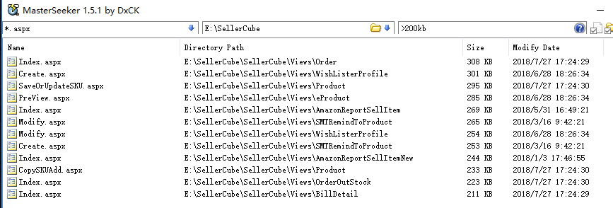
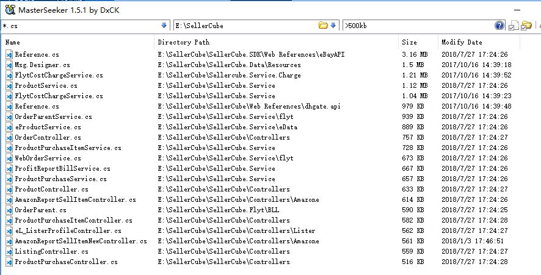

###  OA研发中心技术规划

目标|原因|现状|时间点
-|-|-|-|-
接口化|平台日趋复杂，需微服务化|JAVA项目已100%前后端分离，.NET项目遗留dll接口（平台耦合）|2017Q4
转JAVA|招聘问题、开源生态|各业务组均有JAVA试点项目，旧.NET系统逐渐转为维护型开发|持续
转Angular(前后端分离)|后台表单密集型更适合ng|旧OA采用jqeruy，vue开发，部分项目已经在使用ng|2017Q4
单点登录|系统多需集中认证|多套账号体系共存，部分已改造为CAS SSO|2017Q4
~~Otter同步[异地多活]~~|降低同步维护成本，增加同步可靠性|自己实现的同步逻辑，维护困难|2018
DevOps|使用自动化降低运维成本|已有部分项目使用持续集成|2017Q4
分表分库|数据量大|暂无进展，计划用mycat|2018
转MySQL/PG|配合JAVA生态，免费目的|主要是旧OA用到sqlserver，正在迁移中|持续
审计日志迁大数据|放数据库太大，影响数据库|正在迁移中|2017Q4

###  OA研发中心产品规划

目标|原因|现状|时间点
-|-|-|-|-
多租户/SaaS|系统考虑服务第三方公司|全部服务于棒谷自己|2018
国际化(i18n)|系统受众扩大至全球各地|OA正在试点部分模块国际化|2017Q4
开放平台|开放服务，打造生态|正在打造开放平台|2017Q4
报表BI化|关系型数据库做报表不专业|正在使用大数据技术做报表|持续

### OA研发中心运维规划

目标|原因|现状|时间点
-|-|-|-|-
新一代(https)前置代理|各配各的证书太混乱|正在计划|2017Q4
新一代k8s|JAVA应用需要部署在K8S集群上|正在试点|2017Q4
新一代Spring Boot Admin|JAVA应用需要做统一监控|部分已对接|2017Q3
新一代DNS|由于访问不了外网IP，必须做DNS|各自修改hosts，维护混乱|2017Q4
新一代日志中心|统一管理分析日志|各组自己查看日志不方便，正在用graylog统一中|2017Q4
蓝绿发布|早发晚切，提升部署体验|只能晚上发布，连带开发、测试、运维加班，回滚速度慢，系统会中断|2017Q4
[HTTP2](https://www.jianshu.com/p/67c541a421f9)|提升加载速度,[速度测试](http://www.http2demo.io/),[HA配置](https://ops.tips/blog/haproxy-http2/),[nginx](http://nginx.org/en/docs/http/ngx_http_v2_module.html)|传统http1.x|2018

###  OA研发中心UED规划

目标|原因|现状|时间点
-|-|-|-|-
数据展示优化|表格按字段展示太丑，许多列要合并展示|表格生搬硬套,影响用户心情和效率|持续

###  OA研发中心研发人员提升

针对群体|目标|原因|时间点
-|-|-|-
原.NET开发|学会Angular，以应对前端紧缺的现状|原来就是前后端混合开发，有前端功底，相对java更能上手兄弟语言typescript|持续
原.NET开发|学会[kotlin](http://kotlinlang.org/)|写惯C#的程序员觉得java很啰嗦，可以用kotlin提高代码编写效率|持续

### 微服务的必要性

随时时间的推移，OA项目越来越庞大，急需模块化

