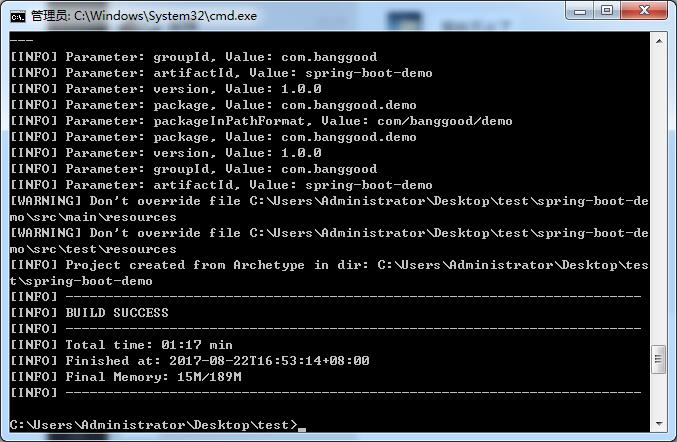
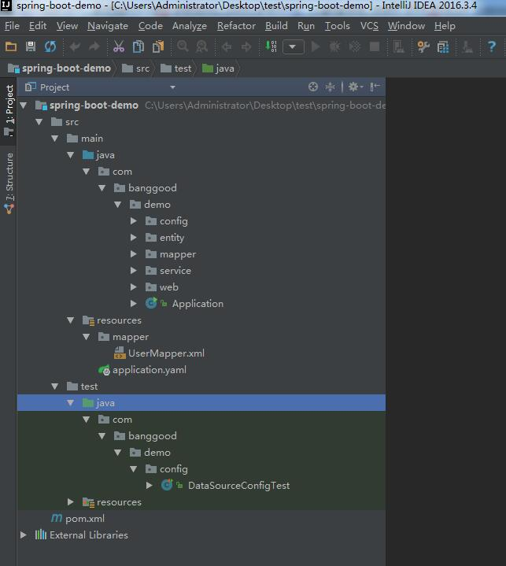
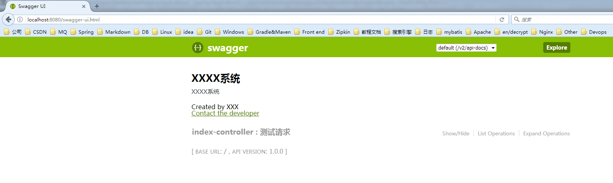

# 基于Maven ArcheType生成棒谷基础项目代码
## 生成步骤
* 是否安装Maven   

		$ mvn -version
		Apache Maven 3.3.9 (bb52d8502b132ec0a5a3f4c09453c07478323dc5; 2015-11-11T00:41:47+08:00)
		Maven home: D:\tools\apache-maven-3.3.9
		Java version: 1.8.0_131, vendor: Oracle Corporation
		Java home: D:\Program Files\Java\jdk1.8.0_131\jre
		Default locale: zh_CN, platform encoding: GBK
		OS name: "windows 7", version: "6.1", arch: "amd64", family: "dos"

* 查看Maven的setting.xml是否指向棒谷内部的nexus(默认目录是`~\.m2\setting.xml`或者Maven的安装目录下`D:\tools\apache-maven-3.3.9\conf\setting.xml`)是否包含`http://192.168.1.73:8081/repository/maven-public/`内容，也就是指向公司的内部的nexus,可以参考[setting.xml](http://192.168.1.122:3000/architecture/Wiki/src/release/maven-archetype/res/settings.xml)来配置   
* 执行下面命令来生成基础项目代码（第一次，会去nexus下载文件，会比较慢）,相关参数请参考[Spring-Boot-Arch](http://192.168.1.122:3000/architecture/bg-project-arch/src/master/spring-boot-arch/README.md) 
	
		mvn archetype:generate  -DarchetypeGroupId=com.banggood  -DarchetypeArtifactId=spring-boot-arch -DarchetypeVersion=1.1.0  -DgroupId=com.banggood  -DartifactId=spring-boot-demo  -Dpackage=com.banggood.demo -Dversion=1.0.0
 

* 使用`Intellij IDEA`将导入生成的项目，如下图如   

* 找到Application，右键`Run as Application`   

* 在浏览器访问[http://localhost:8080/swagger-ui.html](http://localhost:8080/swagger-ui.html)，正常显示则项目生成成功   

## 文档说明
* 关于生成的项目基础代码涉及到的技术，请参照[这篇文档](http://192.168.1.122:3000/architecture/bg-project-arch/src/master/spring-boot-arch/src/main/resources/archetype-resources/README.md)