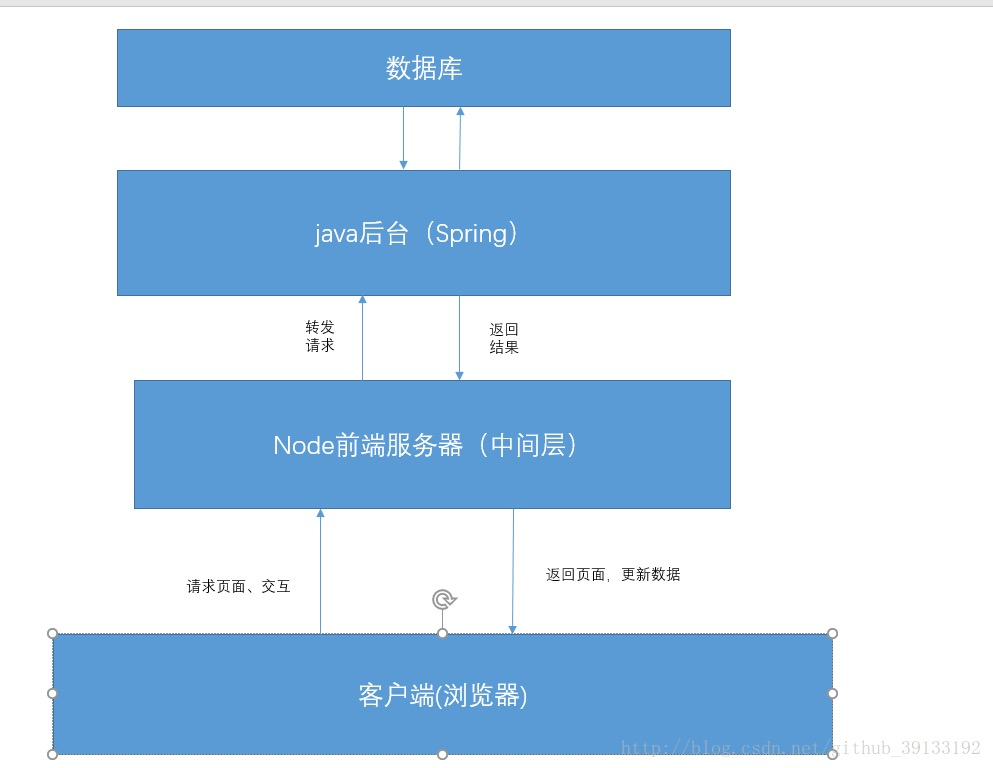

### 方案1
- 在本地架设一个node中间层（不管是用express，还是用egg，都可以实现）
- 通过中间层做为转发层，根据环境的不同对数据做不同的处理：转发，或者是生成模拟数据



```js
'use strict';
//例如，这是通过egg框架实现的一个后端的实践
var mock = require('mockjs')
const Controller = require('egg').Controller;
class UserListController extends Controller {
    async getList() {
        //如果在开发环境，返回mock 数据
        if (this.app.config.env === 'devlope') {
            const data = mock.mock({
                "data|10": [
                    {
                        "title|1": mock.mock('@ctitle()'),
                        "content|1": mock.mock('@cparagraph()'),
                        "name": mock.mock('@cname()'),
                        '_name': function () {
                            return this.name
                        },
                        'regexp|1-5': /\d{5,10}\-/,
                        "id|+1": '0'
                    }
                ]
            })
            this.ctx.body = {
                code: 200,
                data: data.data
            };;
        } else {
            // 向后端请求
            const result = await this.app.curl('https://service.com/user/list', {
                dataType: 'json',
                timeout: 3000,
            });
            this.ctx.body = {
                code: result.status,
                data: result.data
            };
           
        }
    }
}

module.exports = UserListController;

```

####优点：
多了个中间层，可以整合数据接口，后端实现微服务的提供；
前后端分离部署，职责清晰，前端后端人员各自负责各自的领域互相不干涉，后端不需要关心各种业务需求的接口，只需要提供各种基础数据的接口，由前端根据业务需求来进行调整;


### 方案2
- 借助rap第三方的平台，管理接口、生成mock数据


####优点：
能保证所有人使用统一的mock数据；
方便管理接口

缺点：缺少版本管理

