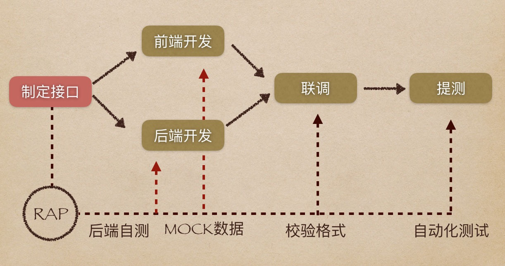
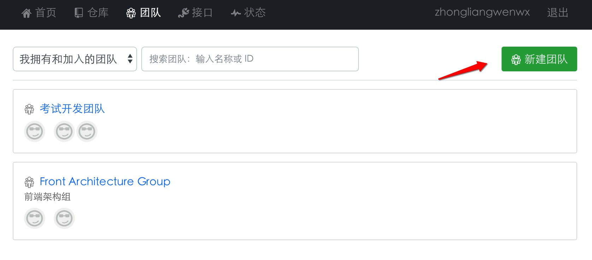
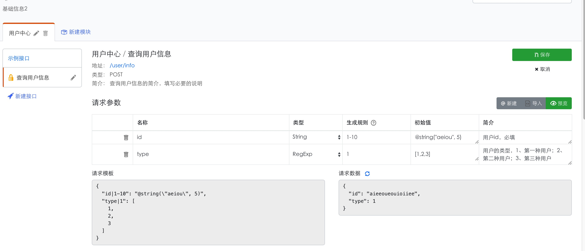
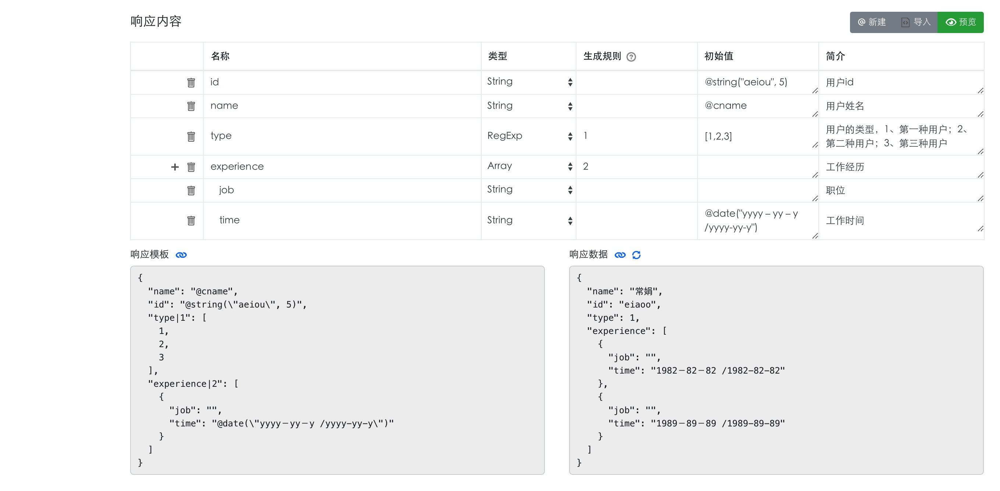

# rap实施流程以及规范

## 目的

- 规范后端提供api文档的方式
- 提高前后端沟通的效率
- 改进流程，让前后端同步开发更加顺畅
- 为前端提供mock数据


## rap2的优点
- 支持mock.js语法：RAP本身基于mcok.js
- 支持接口管理：可管理url地址，不同模块分类。
- 支持团队协作：拥有团队仓库
- 支持历史修改操作查看：可查看接口修改情况，但不支持操作回溯。


### 前后端分离开发的模式



### 使用说明

分成团队和个人创建的仓库；以团队使用的场景进行说明：

- 开发经理或项目负责人创建团队，并添加团队成员；可以新建多个团队，团队数量不限制，方便组建敏捷开发小组团队；

- 将项目相关人员添加到团队后，开发者将能看到本团队内的接口仓库，可以查看信息、调用接口数据
- 在团队内创建接口仓库，团队成员都可以看到该仓库，但是无权限编辑，如果需要加入权限，需要将成员加入仓库的成员中；

- 仓库中分模块归类接口，在同一个仓库中如果接口信息的路径相同，系统会报出警告接口重复；每个仓库、每个接口都有它独特的ID，ID为自动生成，无法手动修改


### 团队移交，可以将建立的团队移交给对接人

一般团队的创建者离职的时候才可能会用到这样的功能

### 前后端配合的阶段

- 前后端沟通阶段：后端人员定制接口，并添加接口信息；前端审查接口是否满足开发需求（开发期间也可以提出修改意见）；
- 开发阶段： 前后端各自同步开发，互相不干涉；前端通过代理或者插件或者中间层转发均可实现请求mock数据；
- 联调阶段： 前端切换到后端的地址进行联调；
- 测试阶段： 联调通过后发布到测试环境进行测试；


### 后端接口信息规范

- 后端人员主要负责：创建接口，以及字段名称、字段简介、初始值；当然，也可以修改生成规则、类型，但这个值可能被前端人员更改；沟通后需要更改的字段需必须立即修改，避免前端的开发被阻塞；
- 传入的参数、返回的字段都必须写简介，说明字段的意义；参数清晰明白，示例和释意明确；字段如果是枚举类型，需要将可能的情况都要实例；
- 后端人员主要负责：创建接口，以及字段名称、字段简介、初始值；当然，也可以修改生成规则、类型，但这个值可能被前端人员更改；
- 返回值数据不要缺失，一般需要有设置默认值：数据类型的变化会带来不可预知的错误，也给前端的逻辑带来更复杂的判断；一般意外的数据，如果是字符串、数字不存在，可以使用null，但是数组如果为空，必须是空数组：[]
- 版本升级：如果某个接口仓库有不同系统的消费者调用，请不要修改原接口，新建一个接口进行说明；接口最好体现版本号，如:api/geit_user/v2;直到旧的接口无消费者使用，才进行删除接口；
- 数据实体层级尽量少，无需嵌套尽量少嵌套，如data.data.data....

```json
// 示例
{
    "status": "1", // 约定错误码，列出各种值的意思；
    "message":"", // 出错了的信息，提示等；
    "data": [
        {
            "id":"12421",
            "name":"张三",
            "img":"http://.."
        },
        {
            "id":"12422",
            "name":"李四",
            "img":"http://.."
        }
    ]//data 是接口主数据，数组或者键值对，后端返回的数据实体
}
```

### 前端使用接口规范

- 新增字段的需求要与后端人员对接，让后端人员加上新的字段；不要私自修改参数和返回值的字段，先沟通，留给后端相关人员处理；

- 前端人员可以修改的值：生成规则、类型，以达到mock的目的，有时候可以将初始值从原始值改成mock语法表达；比如返回的数据条数，姓名的模拟规则，邮件的模拟规则等等，以适应mock数据的要求；如何修改具体参考实例以及mockjs的文档；


### 范例




* [前端如何调取mock数据](./mock.md)

## 通过rap平台沟通的理由

- 前后端通过rap作为平台进行沟通；后端修改接口及时更改rap接口信息，因为更改接口具有外部性，会阻塞他人开发进程；从流程上看，后端服务是前端服务的上游，通过接口信息提供的服务，后端是生产者，前端是消费者；接口详细、便于查看是基本的要求；
- 木桶理论：项目的完成时间取决前、后端最后完成的时间；比如，前端查询文档难、不能及时获取后端接口的信息，影响开发进度，联合调试时不断返工，最后项目上线时间也会被耽搁；

