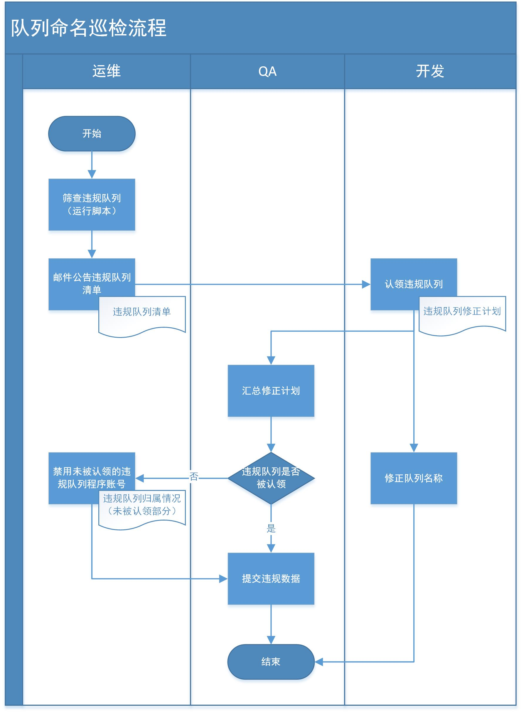

---
layout: default
title: 接口对接规范
---

# 研发中心接口对接规范

##  1 引言

###1.1 目的

通过接口（定义、命名）、交换机命名、路由命名、队列命名、
消息体规范，让相关开发人员有序进行开发，统一格式，互联互通。

### 1.2 适用对象

  本规范适用于OA研发中心的所有开发人员。
  
### 1.３ 适用范围

本规范适用于OA研发中心所有新的（规范发布之后新建的）
独立项目（不在旧OA系统项目里面）。

## 2 接口相关规范

### 2.1 接口定义规范

- 接口需求方提出接口需求描述，所需字段中文名称。
- 接口提供方制定具体的接口命名和使用规则。
- 接口要遵循单一职责原则

### 2.2 接口命名规范

##### 全部小写用下划线分隔单词
```
正确：search_msg、 operate_user_id
错误：Search_Msg（有大写）、searchmsg（没有使用下划线分隔）
```
##### 禁止英文复数写法
```
正确：search_lady_info
错误：search_ladies_info （Ladies是Lady的复数写法）
```
##### 分页查询规范
```
- 1)当返回数据列表超出100条时需要做分页处理。
- 2)分页接口请求参数必须要有页码(page_index)，每页信息条数(page_size)。
- 3)分页接口返回参数必须包含数据总记录数(total_count)。
```
##### 接口返回格式
数据格式统一用JSON
- `target_url`当接口错误时，该属性不为空，为报错接口URI
- `un_auth_req`声明调用接口用户是否有权限调用该接口
- `success`接口返回是否正确，正确则取T泛型结果result，错误则取List<ErrorInfo>
- `err`错误信息
  - `code错误码`，为整形
  - `msg`错误信息
  - `details`错误堆栈
  - `validation_errors`校验属性详情
    - `msg`校验详情
    - `members`错误字段

```json
{
	target_url: "//接口报错时,接口的完整地址，便于前端展示出来给用户截图报障",
	success: true || false || "//前端决定是否弹出错误对话框",
	err: {
		code: "自定义，推荐用数字"，
		msg: "显示给UI的错误信息"，
		details: "UI上默认折叠此字段，当用户报障的时候点击展开，一般显示【服务器堆栈】信息",
		validation_errors: [{
			msg: "字段不能为空",
			members: ["name", "age"]
		}, {
			msg: "日期不得小于今日",
			members: ["date"]
		}]
	},
	result:{
	   //非表格可以是对象，也可以是基本类型
	},
	result:{ //表格
		total_count:102,
		items:[{name:"张三"}，{name:"李四"}]
	},
	un_auth_req: true || false || "//在401的情况下，该值为true,前端识别此字段后统一跳转到登录页面"，
	__silk:'1.1,//如果是java silk框架包装的，加上此字段，值为接口包装版本号'
}
```
##### 接口请求参数
如果该接口返回字段比较多，且接口针对的消费者有多个，应该设置一个**fields**字段，便于让消费者指定字段
类似淘宝的接口 [这里](https://open.taobao.com/docs/api.htm?spm=a219a.7629065.0.0.P5ucyy&apiId=4)

名称|类型|示例值|描述
-|-|-|-|-
fields|Field List|product_id,outer_id|需返回的字段列表.可选值:Product数据结构中的所有字段;多个字段之间用","分隔.

## 3 消息队列相关规范

- 以下规范所提及的组名group参考[《标识规范》](http://hello.banggood.cn/docs/naming-spec.html)。

### 3.1 交换机命名规范

1)规范：
```
x_{group}_{action}，要求所有字母小写，一般要求为topic类型
```
2)解释：
```
{group} 为大组名，比如供应链组，财务组，仓库组等
{action}：做什么用的
```
3)举例：
```
x_supply：部门总交换机（topic类型）
x_supply_purchase：采购相关交换机（topic类型）
```

 ### 3.2路由命名规范

 1)规范：
 ```
 r_{group}_{project}_{module}_{action}，要求所有字母小写
 ```
 2)解释：
 ```
{group} 为大组名，比如供应链组，财务组，仓库组等，我们固定为supply
{project}：项目名，可以视为大组里面的小组名，如我们按照小组名称，有purchase（采购组）、newproduct（新品组）、supplier（供应商组）、product（产品组）
{module}：编码中具体controller的名称
{action}：编码中具体action的名称
 ```
 3)举例：
 ```
r_supply_purchase_supplyewms_auditpurchase
r_supply_purchase_supplyewms_updatesupplier
 ```
 
 ### 3.3队列命名规范

 1)规范：
 ```
q_{group}_{module}_{action}，要求所有字母小写
 ```
 2)解释：
 ```
{group} 为大组名，比如供应链组，财务组，仓库组等
{module}：编码中具体controller的名称
{action}：做什么用的
 ```
 3)举例：
 ```
q_supply_supplyewms_handler 
 ```
 
### 3.4消息体规范
  
- 将数据实体转化为JSON字符串做为消息体。
- 消息体中各字段命名使用全部小写用下划线分隔单词(详见2.2)
- 消息体只包含单次业务逻辑需要的数据，不包括其它额外数据(如消息发送时间，校验码等)
  
## 4 队列命名巡检

- 为保证开发人员能够按照规范要求进行命名，避免出现应用运行异常时找不到负责人处理的情况，将执行月度检查的方式，定期对未按照规范要求命名的队列进行筛查，具体流程如下：
- 

### 4.1 流程说明

- **违规队列筛查**：运维人员执行脚本，将未按照规范要求命名的交互机、路由以及队列筛查出来后，形成《违规队列清单》，并以邮件以及企业微信群组（OA研发中心）进行公告；
	- 邮件主送OA研发中心（具体群组邮箱以行政输出的为准），抄送部门总监、各线开发负责人、QA、BP； 
- **违规队列认领**：运维公告发出后，各线开发负责人安排组内人员进行自检，在五个工作日内确认违规队列清单中是否有自己的队列，并制定对应的修正计划，开发负责人(或授权人员)汇总本组情况后发送QA；
	- 所提交的修正计划中，要求标明原队列名称、所属组别、责任人、计划修正完成时间，具体可参考文末模板；
- **违规记录汇总**：QA收集并汇总各线违规队列修改计划后，确认所有违规队列皆被认领后，整理违规情况提交给相关负责人进行绩效方面扣罚。
	- 当出现违规队列在限期内（5个工作日内）未被认领的，则提交给运维人员进行排查，通过禁用该队列的程序账号定位具体的责任人以及责任部门。

### 4.2 执行时间规则

- 运维人员违规队列筛查：每月5号前；
- 开发人人员违规队列认领：每月5-10号；
- QA违规数据核对与确认：每月25-30号；
- QA违规数据提交：次月1-2号。

### 4.3 定责标准

- 针对未按照规范要求对交互机、路由、队列进行命名的，将追究责任人并记录违规。
- 以开发线为单位，执行月度记录，记录具体的违规队列以及对应的责任人，按实际违规队列数量考核责任人、责任人直属上级以及该线开发负责人（M3）。
```
举例说明：假如某月发现小A有2个违规队列，则小A、小A的直属上级、小A所在开发线的M3负责人都被记录违规2次。
```
## 5 相关附件

- [《【模板】违规队列修正计划》](https://xt.banggood.cn/#/knowledge?openByLink=https%3A%2F%2Ffinder.banggood.cn%2Ffinder-front%2Findex.html%23%2Ffile%2Fpublicnew%2FpreviewNew%2F460759085034377216)

