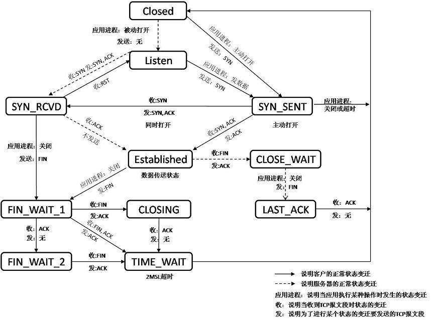

### TCP状态迁移图



### TIME_WAIT

[服务器TIME_WAIT和CLOSE_WAIT详解和解决办法](https://www.cnblogs.com/sunxucool/p/3449068.html)

过程|描述
-|-
客户端新建连接|发技能
客户端断开连接|技能完成
TIME_WAIT|技能冷却中，需要等待2MSL后变为初始态（CLOSED）

*ps:为何需要“冷却时间”？*

1. 为实现TCP全双工连接的可靠释放   

	万一client_ack丢失，服务端会重发FIN，此时客户端仍需要负责善后，再次发送client_ack

2. 为使旧的数据包在网络因过期而消失

	客户端着急使用一个刚刚关闭的连接，万一网络中还有上个连接中因为阻塞等原因的旧数据此时达到，本来是属于上个连接的，
	被新的连接接收到会发生不可预知的事情（灵异事件）

#### 应对方案

- linux设置SO_REUSEADDR选项
- windows修改注册表TcpTimedWaitDelay和MaxUserPort

### CLOSE_WAIT

以下两种情况导致程序占用连接，而操作系统替应用无权(也无法确定)清理连接

1、服务端主动关闭连接之后，客户端未检测到

2、客户端忘记关闭连接

以上可统一视为服务端已断开，而客户端无动于衷

出现这种问题应该检测客户端的代码逻辑


### Win查看连接状态

```
netstat -ano
netstat -an | find /i /c "CLOSE_WAIT"
netstat -an | find /i /c "TIME_WAIT"
```

### Linux查看连接状态

```
netstat -n | awk '/^tcp/ {++S[$NF]} END {for(a in S) print a, S[a]}'
```

### Win查看动态端口范围 

```
netsh int ipv4 show dynamicport tcp
netsh int ipv4 show dynamicport udp
netsh int ipv6 show dynamicport tcp
netsh int ipv6 show dynamicport udp
```

### win设置动态端口范围

```
netsh int ipv4 set dynamicport tcp start=10000 num=1000
netsh int ipv4 set dynamicport udp start=10000 num=1000
netsh int ipv6 set dynamicport tcp start=10000 num=1000
netsh int ipv4 set dynamicport udp start=10000 num=1000
```

### linux动态端口范围

[Linux 查看服务器开放的端口号](https://www.cnblogs.com/kerrycode/p/5609010.html)

```
cat /proc/sys/net/ipv4/ip_local_port_range
```