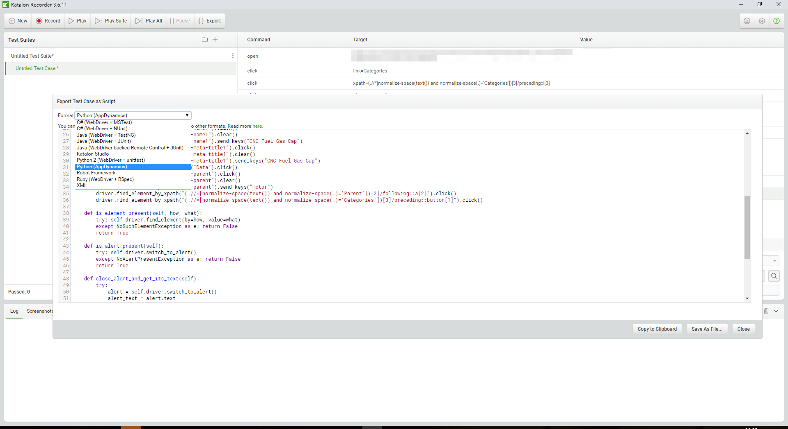
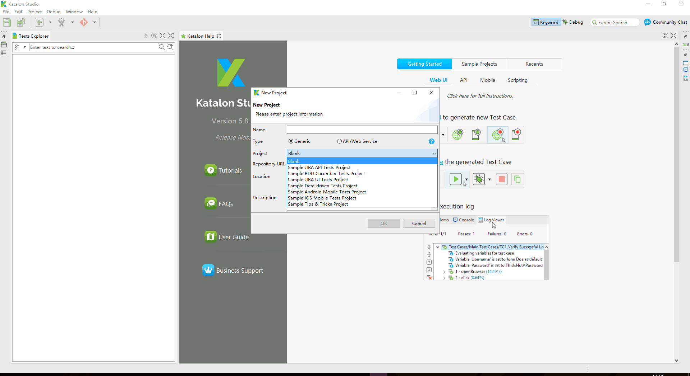

### 关于软件测试

#### 功能测试

OA研发中心的绝大多数项目采用**“人肉测试”**，自动化测试能覆盖所有无状态场景，对有状态的自动化，目前尚无很好方案

#### UI动作脚本录制工具 

[katalon](https://www.katalon.com/)  

katalon是一个浏览器插件，录制后可以生成各种测试平台代码

#### 关于BDD(行为驱动开发)

编写`gherkin`脚本，自动生成测试代码，`gherkin`作为一种DSL，描述了测试场景和行为
Java项目可采用[Cucumber](https://cucumber.io/)

[JAVA示例](https://github.com/cucumber/cucumber-jvm)

.NET项目采用[Specflow](http://specflow.org/)

[.NET示例,orchard](https://github.com/OrchardCMS/Orchard/tree/dev/src/Orchard.Specs)

[去Github看别人怎么写BDD](https://github.com/search?l=&p=1&q=%E9%82%A3%E4%B9%88+extension%3Afeature&ref=advsearch&type=Code&utf8=%E2%9C%93)

#### 关于单元测试

以下项目均要求做单元测试

	基础组件
	随时间变化不大的代码

所谓单元测试 就是强调单元，比如一个函数，但是一般都会有其它依赖，此时可以借助Mock库，[mockito文档](https://www.tutorialspoint.com/mockito/index.htm)

#### 接口测试

目前无任何经验表明该测试可行以及带来的效率提升，且没有任何工具提供支撑

#### 性能测试

比较重要，JAVA 和 .NET 项目可以各自做自己的性能测试

#### 全球知名测试解决方案

[watir](http://watir.com/)   
[ibm rational](https://www.ibm.com/us-en/marketplace/rational-functional-tester)   
[teststudio](https://www.telerik.com/teststudio)   
[silk-test](https://www.microfocus.com/products/silk-portfolio/silk-test/)   
[worksoft-certify](https://www.worksoft.com/products/worksoft-certify)   
[katalon](https://www.katalon.com/)   
[leapwork](https://www.leapwork.com/)   
[testcomplete](https://smartbear.com/product/testcomplete/overview/)    
[testim](https://www.testim.io/)    
[zephyr](https://www.zephyrproject.org/)    
[ranorex](https://www.ranorex.com/)   
[squish](https://www.froglogic.com/squish/editions/qt-gui-test-automation/)    
[qmetry](https://www.qmetry.com/automated-testing-tools-qmetry-automated-studio/)   
[tricentis](https://www.tricentis.com/)   
[maveryx](https://www.maveryx.com/)   
[testcraft](https://www.testcraft.io/)   
[mabl](https://www.mabl.com/)   
[seleniumhq](https://www.seleniumhq.org/)   
[functionize](https://www.functionize.com/)   
[QTP](https://software.microfocus.com/en-us/products/unified-functional-automated-testing/overview)   

