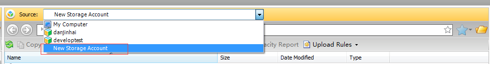
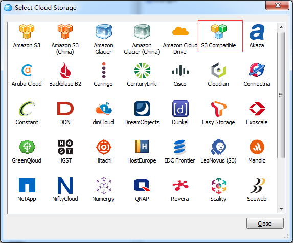
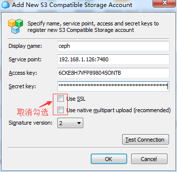
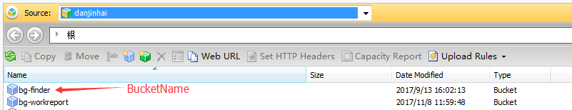

## ceph文件服务器使用手册

----------

#### 目录

&ensp;&ensp; 1\.[背景](#projectBackground)

&ensp;&ensp; 2\.[负责人](#projectPerson)

&ensp;&ensp; 3\.[使用说明](#projectExplain)

&ensp;&ensp; 4\.[结构&项目](#projectStructure)

&ensp;&ensp; 5\.[ceph文件服务器使用介绍](#projectUse)

&ensp;&ensp; 6\.[ceph客户端使用介绍](#projectClient)

&ensp;&ensp; 7\.[使用注意事项,相关说明](#projectAttention)

<span id="projectBackground"></span>
#### 背景

提供了ceph文件服务器上传、下载的使用方法及注意事项。

<span id="projectPerson"></span>
#### 负责人

- 开发负责人 刘明智
- 运维负责人 丹金海

<span id="projectExplain"></span>
#### 使用说明

- pom.xml文件引用

```xml
		<dependency>
			<groupId>com.amazonaws</groupId>
			<artifactId>aws-java-sdk</artifactId>
			<version>1.11.210</version>
		</dependency>
```
- ceph服务器相关配置
- 创建连接,连接到s3服务器
- 上传/下载接口调用

<span id="projectStructure"></span>
#### 结构&项目

```
 |——com/banggood
 |    |——component
 |    |    |——impl
 |    |    |    |——AmazonS3ComponentImpl AmazonS3业务接口实现
 |    |    |——AmazonS3Component AmazonS3业务接口
 |    |——config
 |    |    |——AmazonS3Properties 文件服务器配置类
 |    |——util
 |    |    |——HttpClientUtil http工具类
```

> [项目地址](http://192.168.1.122:3000/SKB_PPS/pps-demo/src/master/bg-ceph-utils)


<span id="projectUse"></span>
#### ceph文件服务器使用介绍

##### ceph服务器配置类

- ceph服务器配置类

```
@Getter
@Setter
@Component
@ConfigurationProperties(prefix = "amazonS3")
public class AmazonS3Properties {

    /**
     * accessKey
     */
    private String accessKey;

    /**
     * secretKey
     */
    private String secretKey;

    /**
     * 服务器地址
     */
    private String endPoint;
}
```
- ceph文件服务器测试环境配置(yml配置)

```
#ceph文件服务器相关配置
amazonS3.access-key: 6CKE8H7VFP898045ONTB
amazonS3.secret-key: cu7oMjjCcFGKJN9DjdKIjqM189rtjBkkIMl2m7F7
amazonS3.end-point: 192.168.1.126:7480
```

##### AmazonS3Component服务相关接口,使用方法
- 创建连接，连接S3服务器

```java
    @Autowired
    private AmazonS3Properties amazonS3Properties;

    private static AmazonS3 conn;

    public static AWSCredentials awsCredentials;


    /**
     * 创建连接，连接S3服务器
     * PostConstruct在构造函数之后执行
     * @author liumingzhi 2017/09/06
     */
    @PostConstruct
    public void creatConnect() {
        if (awsCredentials == null) {
            awsCredentials = new BasicAWSCredentials(amazonS3Properties.getAccessKey(), amazonS3Properties.getSecretKey());
            ClientConfiguration clientConfig = new ClientConfiguration();
            clientConfig.setMaxConnections(500); //暂时设置最大连接500
            clientConfig.setProtocol(Protocol.HTTP);
            conn = new AmazonS3Client(awsCredentials, clientConfig);
            conn.setEndpoint(amazonS3Properties.getEndPoint());
            S3ClientOptions s3ClientOptions = new S3ClientOptions();
            s3ClientOptions.setPathStyleAccess(true);
            conn.setS3ClientOptions(s3ClientOptions);
        }
    }
    public AmazonS3 getConnect() {
        if (awsCredentials == null) {
            creatConnect();
        }
        return conn;
    }
```
- 上传文件到文件服务器(根据文件流上传)

```java
    /**
     * 上传文件到容器
     *
     * @param bucketName  bucketName
     * @param filePath    文件路径 格式: 文件夹名/子文件夹名/ (以/结束)
     * @param fileName    文件名
     * @param inputStream 文件流
     * @return 上传结果
     * @author liumingzhi 2017/09/06
     */
    PutObjectResult creatObject(String bucketName, String filePath, String fileName,
                                       InputStream inputStream);
```
- 获取文件服务器临时Url

```
    /**
     * 生成文件url
     *
     * @param bucketName bucketName
     * @param fileFullPath 文件绝对路径 格式: a/a.txt
     * @return 临时url
     * @author liumingzhi 2017/09/06
     */
    String getDownloadUrl(String bucketName, String fileFullPath);
```

- 从ceph服务器下载文件

```
    /**
     * 下载文件
     * @param response 响应请求
     * @param bucketName bucket名
     * @param fileFullPath 文件绝对路径 格式: a/a.txt
     * @author liumingzhi 2017/09/06
     */
    void downloadFile(HttpServletResponse response, String bucketName, String fileFullPath) throws IOException;
```
- 获取文件流信息

```
    /**
     * 获取文件流
     * @param bucketName bucketName
     * @param fileFullPath 文件绝对路径 格式: a/a.txt
     * @return 文件流
     * @throws IOException
     * @author liumingzhi 2017/09/06
     */
    InputStream getInputStreamByUrl(String bucketName, String fileFullPath) throws IOException;
```
<span id="projectClient"></span>
#### 客户端使用介绍
- 下载 Amazon S3客户端,使用邮箱注册
> [下载地址](http://192.168.1.122:3000/SKB_PPS/pps-demo/src/master/bg-ceph-utils/client/CloudBerryExplorerSetup_v5.2.0.14_netv4.0.exe)

- 新建一个Storage Account,选择S3 Compatible,使用测试配置帐号登录

>   

>   

> 

- 使用时先创建一个Bucket,之后可以创建文件夹/文件,跟资源管理器一样  

> 

<span id="projectAttention"></span>
#### 使用注意事项,相关说明

- 如果文件服务器的endPoint地址为域名的话,创建连接需要加上以下配置,不然会访问不了文件服务器

```
/*这里如果文件服务器的地址域名访问,需要使用以下配置*/
S3ClientOptions s3ClientOptions = new S3ClientOptions();
s3ClientOptions.setPathStyleAccess(true);
conn.setS3ClientOptions(s3ClientOptions);
```

- 提示Unable to execute HTTP request: Timeout waiting for connection from pool

```
clientConfig.setMaxConnections(500); //暂时设置最大连接500
升级pom版本

```

- 下载文件名乱码问题

```
/*解决文件名乱码*/
response.setHeader("Content-disposition", String.format("attachment; filename=\"%s\"", new String(fileName.getBytes(), "ISO8859-1")));
```

- 相关链接

*   [相关链接](http://blog.csdn.net/tomcat_2014/article/details/50582547?locationNum=14&fps=1)
*   [使用规范](https://xt.banggood.cn/#/knowledge?openByLink=https%3A%2F%2Ffinder.banggood.cn%2Ffinder-front%2Findex.html%23%2Ffile%2Fpublicnew%2FpreviewNew%2F428936674714718209)