# 网关API发布操作说明

### 一、进入网关

- 使用棒谷单点登录进入网关（[正式环境网关](http://gateway.sellercube.com/)，[测试环境网关](http://gateway.dev.sellercube.com/)）：

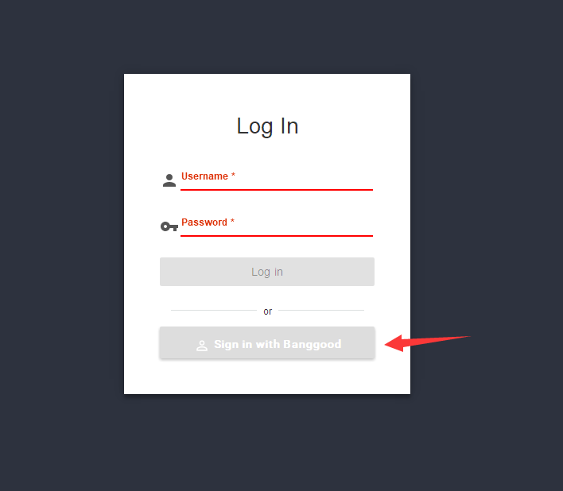

- 主界面：右下角“+”按钮新增一个API，左侧“APIs”选项卡显示管理的API列表，“Applications”选项卡显示订阅API的应用列表。一个Application可以订阅多个API。

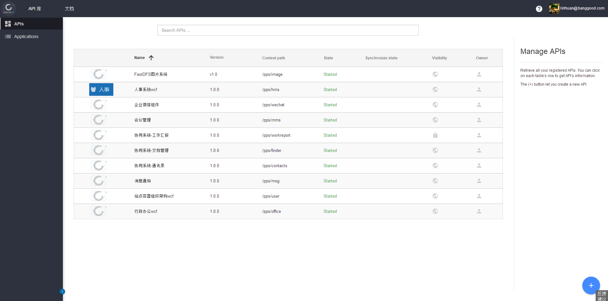

### 二、添加API

- (1) API界面：点击右下角“+”按钮新增一个API，可选按照swagger的json文件和swagger的json地址两种方式添加。

> 需要注意的是，填swagger地址时，不是 http://xxx.xxx/swagger-ui.html 这种地址，而是swagger实际的json文件地址，具体需要自己查看。

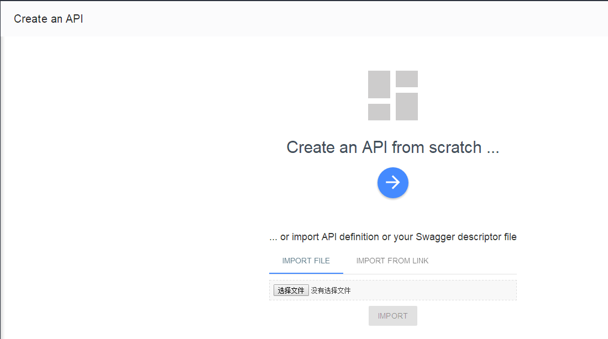

- (2) General界面：填写完swagger的json文件地址后，进入API界面，在“General”选项卡中按照规范填写API信息。

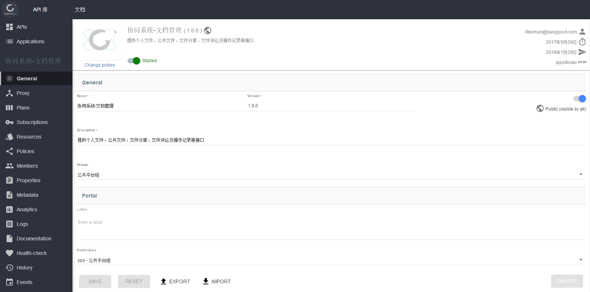

- (3) Proxy界面：设置`Gateway context path`。`Gateway context path`是网关中区分各个API的标识符，需要按照规范设置。

- (4) Proxy界面：设置`Endpoints`。`Endpoints`列表中是API的源地址，点击“+”按钮添加一个源地址。然后填写`Name`和`Target`，`Target`即API的源地址。其它内容保持默认，填写完成后拉到最下面点击保存。

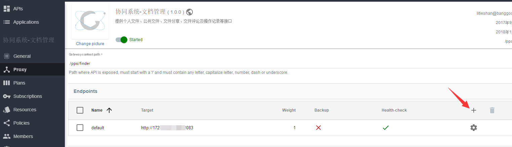
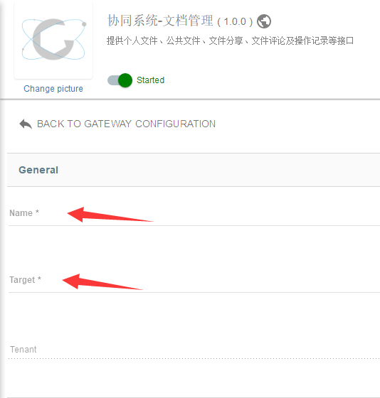

- (5) Proxy界面：跨域配置。给`Access-Control-Allow-Headers`和`Access-Control-Expose-Headers`添加以下几个值：`X-Gravitee-Api-Key`, `Authorization`, `Content-Type`, `Accept`。这里填的值要包含浏览器请求头中`Access-Control-Request-Headers`发送的头。除此之外，如果使用方的请求头中`Access-Control-Request-Headers`还发送了额外的头（图片中示例`x_requested_with`即是额外的头），此时也需要在网关的跨域配置中添加这个额外的头，否则浏览器的Options请求（跨域预检）失败。其它内容保持默认，填写完成后拉到最下面点击保存。

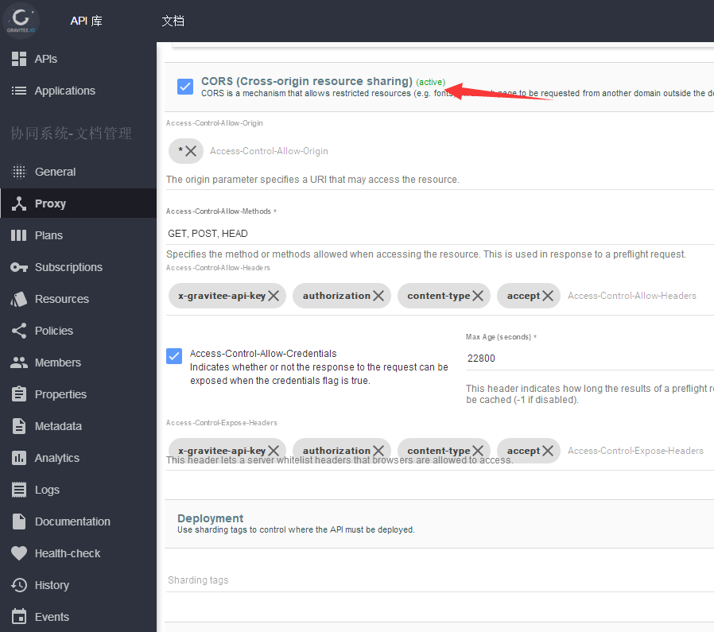
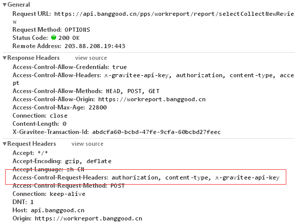
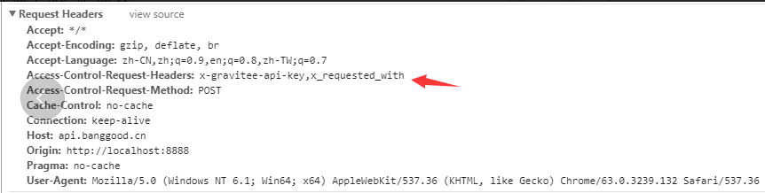

- (6) Plans界面：此项设置需要`X-Gravitee-Api-Key`才能调用API。点击“+”按钮添加一个Plan，`Name`和`Description` 都填`内部订阅`，`Security Type` 选择 `API KEY` ，其它内容保持默认。

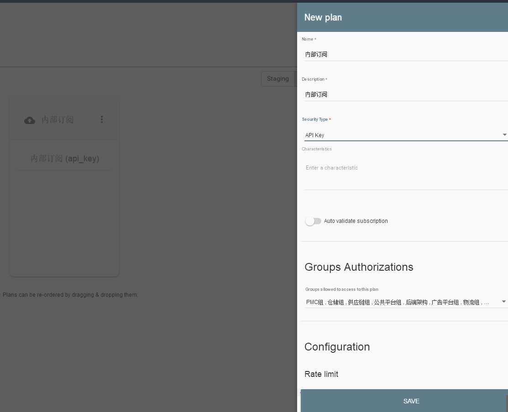

- (7) Plans界面：发布刚才添加的Plan。

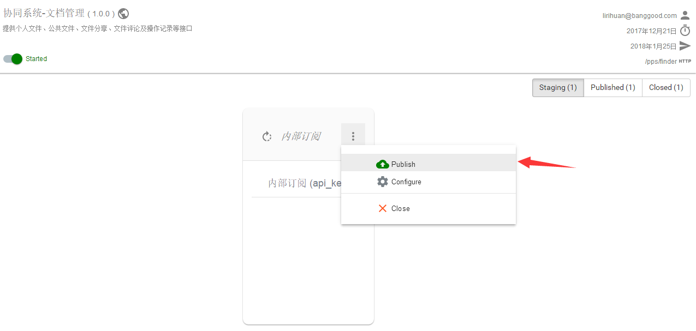

- (8) Resources界面：此项设置需要`Authorization`才能调用API。点击“+”按钮添加一个Resource，`Name`填`oauth2.0`，`Type`选择`Generic OAuth2 Authorization Server Resource`，然后在Configuration配置项中，按下图所示填入信息。

> 需要注意的是，`Authorization server URL`一项，测试网关填写`https://castest.banggood.cn`，正式网关填写`https://cas2.banggood.cn`
> `Client Id`和`Client Secret`两项，测试网关都是`123456`，正式网关请自行复制其它API里面填入的信息。

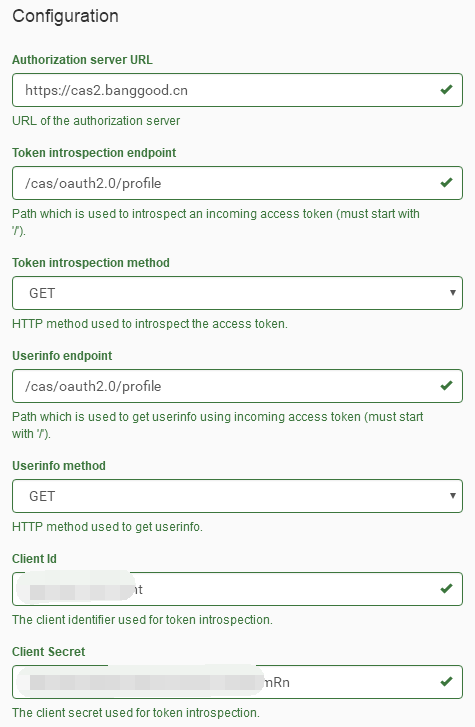
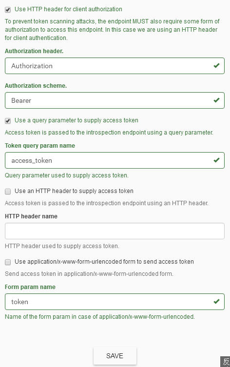

- (9) Policies界面：URL策略配置。可对API中的不同的URL配置策略，这里需要设置`OAuth2`策略。顶部有一个`/`的URL表示这是API的根路径策略配置，在第(1)步添加API时，这里会自动添加swagger json文件里的所有URL地址，点击每个路径会显示已配置的策略，默认是没有配置策略的。此时，需要删除所有自动添加的URL(稍后说明原因)。现在开始配置`OAuth2`策略。点击`/`的URL路径，然后在左边Policies列表，把`OAuth2`方块拖过来，然后在右边填写内容。`OAuth2 resource`填写`oauth2.0`，与第(8)步中添加的Resource的`Name`保持一致即可。其它内容保持默认，点击保存。

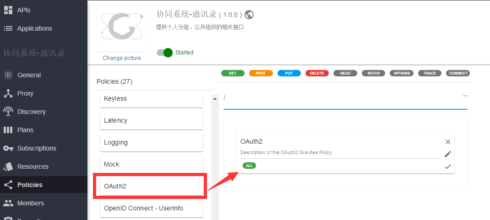
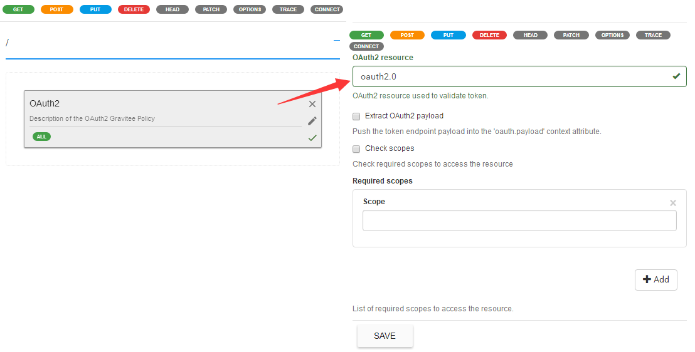

> 新添加的子路径(例如：`/file/batchDownloadFiles`)，默认没有策略，也不会自动继承根路径配置的策略。如果子路径没有添加，则会自动继承根路径配置的策略。
> 因此，想要所有的路径都配置上`OAuth2`策略，需要删除所有自动添加的URL。

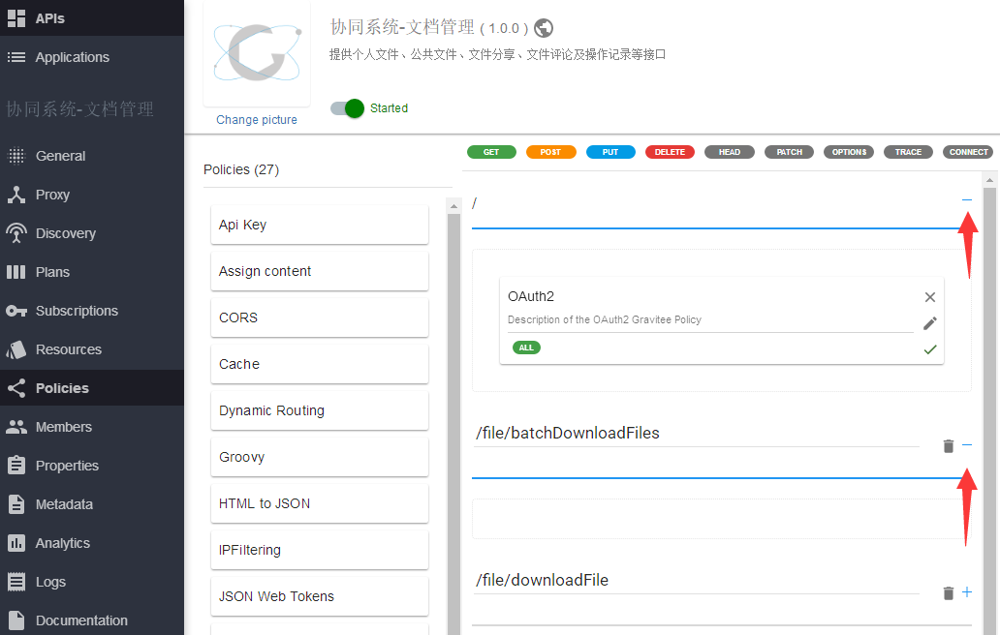

- (10) 检查API是否已正确启动。在任意界面中，如果有看到一条横杠提示`API out of sync`，需要点击`deploy your API`才能使已更改的配置生效。除此之外，回到General界面，检查API是否已启动，API可根据需要设置为公开/私有。

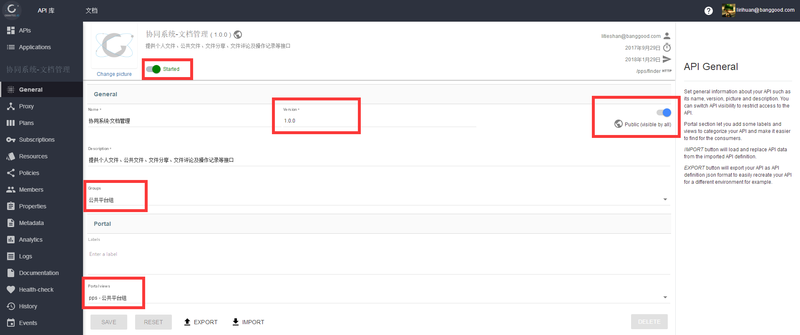

### 三、调用API

[网关API调用说明（前端&后端）](http://192.168.1.122:3000/SKB_PPS/pps-doc/src/master/%E7%BD%91%E5%85%B3API%E8%B0%83%E7%94%A8%E8%AF%B4%E6%98%8E%EF%BC%88%E5%89%8D%E7%AB%AF%26%E5%90%8E%E7%AB%AF%EF%BC%89.md)