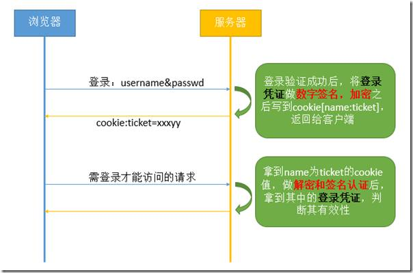

##### Editor：chenrouyan-2018-4-23

## web的三种会话管理方式

#### 引言

http是无状态的，它无法告诉服务器当前发起请求的用户是谁，更无法判断该用户是否有继续请求的权限。而对我们应用而言，它是需要状态管理，以便告诉服务器当前发起请求的用户是谁，从而判断该用户是否有继续请求的权限。而这一过程即为会话管理。下面我们将介绍相关的三种会话管理方式：

- 基于server端session的管理方式

- cookie-base的管理方式

- token-base的管理方式

#### 正文

>#### 基于server端session的管理方式

  

* session的概念

  * session代表服务器与浏览器的一次会话过程，这个过程是连续的，也可以时断时续的。在Servlet中，session指的是HttpSession类的对象。

  

* session何时？如何被创建

  * session访问客户端且server端程序调用 HttpServletRequest.getSession(true)这样的语句时才被创建。

  * 服务器为每一个session都分配一个唯一的sessionid，以保证每个用户都有一个不同的session对象。

  

* session如何管理会话

  * 服务器创建完session-> sessionid通过cookie返回到相应浏览器-> cookie把sessionid传回服务器（用户二次请求时）-> 服务器根据sessionid匹配用户对应session对象-> session获取管理会话资格-> session判断当前用户是否已登录；

  * session获取管理会话资格： 在用户登录认证成功之后，往sesssion对象里面放入了用户登录成功的凭证；

  * session判断当前用户是否已登录：取用户的session对象，看其是否有登录成功的凭证。

  

>#### cookie-base的管理方式

管理流程如图：

* 用户发起登录请求，服务端根据传入的用户密码之类的身份信息，验证用户是否满足登录条件，如果满足，就根据用户信息创建一个登录凭证，这个登录凭证简单来说就是一个对象，最简单的形式可以只包含用户id，凭证创建时间和过期时间三个值。

* 服务端把上一步创建好的登录凭证，先对它做数字签名，然后再用对称加密算法做加密处理，将签名、加密后的字串，写入cookie。cookie的名字必须固定（如ticket），因为后面再获取的时候，还得根据这个名字来获取cookie值。这一步添加数字签名的目的是防止登录凭证里的信息被篡改，因为一旦信息被篡改，那么下一步做签名验证的时候肯定会失败。做加密的目的，是防止cookie被别人截取的时候，无法轻易读到其中的用户信息。

* 用户登录后发起后续请求，服务端根据上一步存登录凭证的cookie名字，获取到相关的cookie值。然后先做解密处理，再做数字签名的认证，如果这两步都失败，说明这个登录凭证非法；如果这两步成功，接着就可以拿到原始存入的登录凭证了。然后用这个凭证的过期时间和当前时间做对比，判断凭证是否过期，如果过期，就需要用户再重新登录；如果未过期，则允许请求继续。

  

>#### token-base的管理方式

管理流程如图：

* 这种方式从流程和实现上来说，跟cookie-based的方式没有太多区别，只不过cookie-based里面写到cookie里面的ticket在这种方式下称为token，这个token在返回给客户端之后，后续请求都必须通过url参数或者是http header的形式，主动带上token，这样服务端接收到请求之后就能直接从http header或者url里面取到token进行验证
 
 基于 Token 的身份验证方法
* JWT（Json Web Token）是一个以JSON为基准的标准规范，通过JSON来传递消息。具体定义可以参见[这里](http://self-issued.info/docs/draft-ietf-oauth-json-web-token.html)   
JWT常常通过HTTP的header来传送信息，同时也可以通过URL来传送。JWT自身会携带所有的信息，包括payload和signature。  
* JWT的token构成：
  * header：一个是 Token 的类型，另一个是使用的算法
  * payload：Token 的具体内容（标准字段含iss、sub、aud、exp、nbf、iat、jti）
  * signature：由 header、 payload、 secret三部分组成

* token串的特点
  * 紧凑：指的是这个串很小，能通过url 参数，http 请求提交的数据以及http header的方式来传递；
  * 自包含：这个串可以包含很多信息，比如用户的id、角色等，别人拿到这个串，就能拿到这些关键的业务信息，从而避免再通过数据库查询等方式才能得到它们。
  